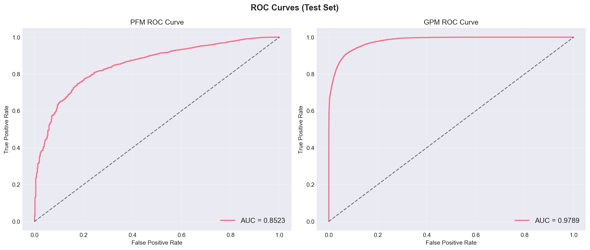
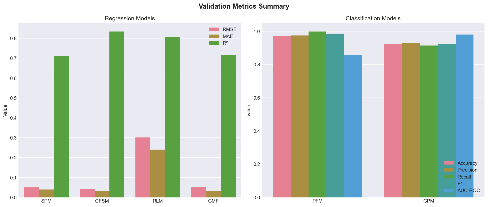
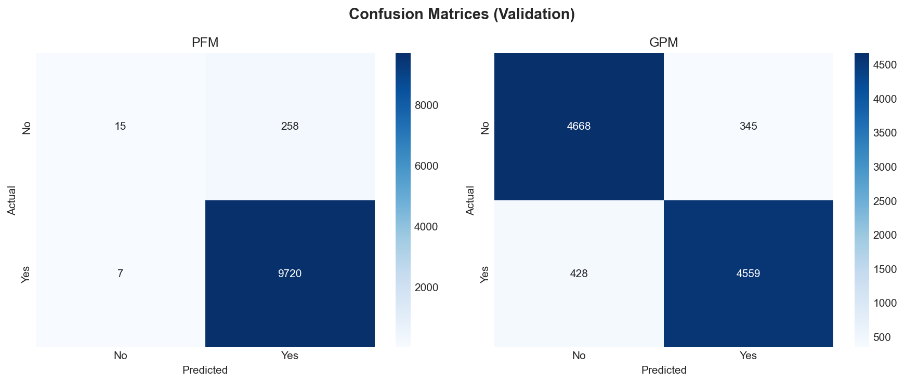
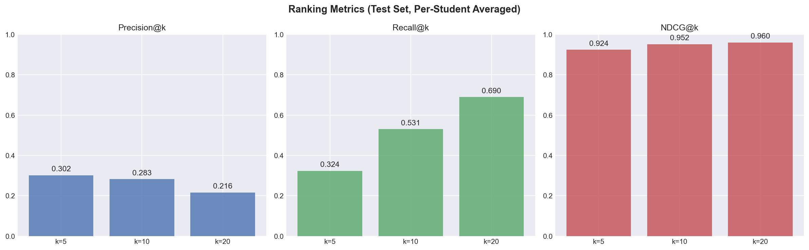
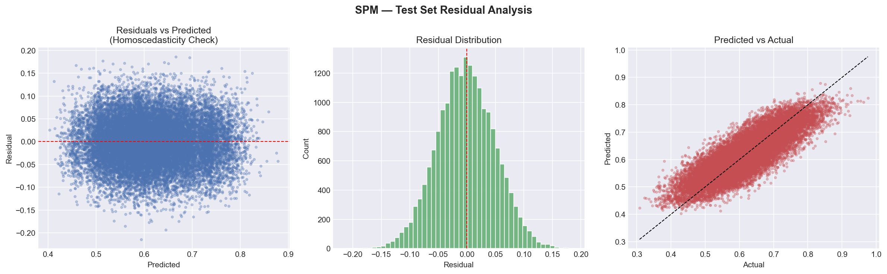
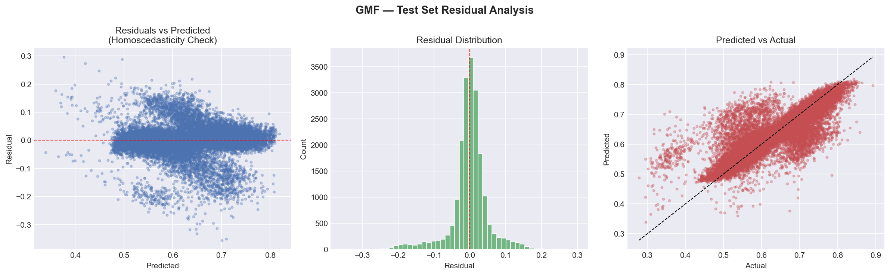
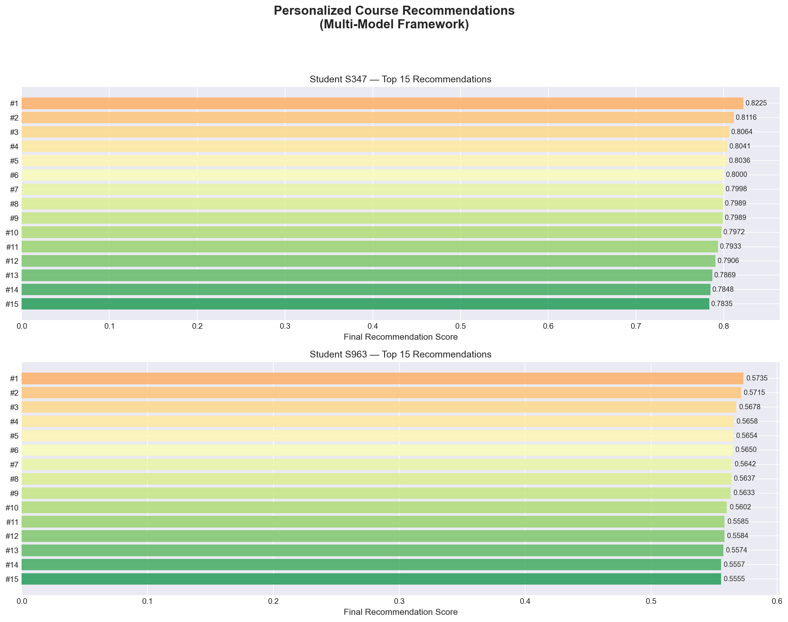

# 🎓 Personalized Course Recommendation System
### A Multi-Model Machine Learning Framework for Academic Success


This project builds an intelligent **Course Recommendation System** that suggests the most suitable courses to university students based on their academic profile, learning history, and degree requirements. Unlike generic recommendation engines (such as Netflix or Amazon) that rely on simple user-item similarity, academic course selection demands awareness of strict academic rules — a student must meet **prerequisite requirements**, courses must align with their **graduation timeline**, the workload must match their **current academic capacity**, and the recommended courses should maximize their **probability of success**.

To solve this, we implement a **multi-model machine learning framework** where five specialized models each handle one academic constraint independently (success prediction, course fit, prerequisite checking, graduation prioritization, and workload estimation), and a sixth **global meta-model** intelligently combines all five outputs into a single, unified recommendation score. The system then ranks courses by this score and presents the student with a personalized, constraint-aware Top-N course list — ensuring every recommendation is not just relevant, but academically safe and strategically optimal for their degree progress.

---

## 📖 Theoretical Overview

This repository contains the complete replication and adaptation of the hierarchical, multi-model machine learning framework originally proposed in the research paper:

> **"Personalized Course Recommendation System: A Multi-Model Machine Learning Framework for Academic Success"** 
> *(Islam & Hosen, MDPI Digital 2025)*.

While the original authors validated their methodology using a purely synthetically generated dataset (DF4, containing 101,330 records with 25 features), this project takes their framework a step further. We successfully adapted, trained, and validated the identically structured architecture using **real-world, open-source educational datasets** from Kaggle, proving the real-world viability of their methodology on authentic student enrollment data.

### Why This Approach?

The core motivation behind this architecture is the assertion that **course advising cannot be modeled by simple collaborative filtering**. Unlike entertainment or e-commerce recommendations (Netflix, Amazon), academic course selection is governed by rigid, non-negotiable constraints:

- 🔗 **Prerequisite Chains** — A student cannot take Advanced Machine Learning without completing Linear Algebra first.
- ⚖️ **Credit Load Limitations** — Overloading a student with too many courses reduces success probability.
- 🎓 **Graduation Requirements** — Certain courses must be prioritized to meet degree completion timelines.
- 📊 **Academic Capability** — A student with a low GPA should not be recommended highly advanced courses.

Traditional recommendation approaches like Collaborative Filtering (CF) and Content-Based Filtering (CBF) fundamentally fail to capture these multi-dimensional constraints simultaneously. CF relies on user-item interaction patterns and suffers from cold-start problems, while CBF matches content features but ignores academic constraints entirely.

Islam & Hosen (2025) proposed a novel solution: **decompose the recommendation task into five independent sub-problems**, each solved by a specialized machine learning model, and then synthesize the results through a global meta-model. This is the architecture we replicate.

---

## 📊 Datasets Used & Feature Engineering

To synthesize a highly realistic environment matching the paper's mathematical requirements, we evaluated six candidate datasets and selected the following pair based on feature richness, numeric density, and compatibility:

### 1. Course Data
**[Udemy Course Recommendation Dataset](https://www.kaggle.com/datasets/evilspirit05/udemy-course-recommendation)**

| Raw Feature | Engineered Feature | Engineering Method |
|-------------|-------------------|-------------------|
| Course Level (text) | `course_difficulty` (1-4) | Mapped: Beginner=1, Intermediate=2, Expert=3, All=2 |
| Subscriber Count | `norm_subscribers` | Log-transformed: `log1p(subscribers)` |
| Review Count | `norm_reviews` | Log-transformed: `log1p(reviews)` |
| Subscribers + Reviews | `course_popularity` | Weighted composite: `0.6×log(subs) + 0.4×log(reviews)` |
| Price | `course_cost` | Direct numeric conversion |
| Lectures + Duration | `content_richness` | `log1p(lectures) + log1p(duration)` |
| Subject/Category | `subject_encoded` | Label encoded (ordinal) |

### 2. Student Data
**[College Student Management Dataset](https://www.kaggle.com/datasets/ziya07/college-student-management-dataset)**

| Raw Feature | Engineered Feature | Engineering Method |
|-------------|-------------------|-------------------|
| GPA | `student_capability` | Normalized to [0,1]: `GPA / max(GPA)` |
| Attendance, LMS Logins, Assignments | `engagement_score` | Min-max per column → averaged |
| Course Load | `current_load` | Direct mapping |
| Enrollment Status | `enrollment_encoded` | Label encoded |
| Risk Level (Low/Med/High) | `risk_encoded` | Ordinal: Low=0, Medium=1, High=2 |

### 3. Interaction Matrix
Since the paper used a single unified dataset, we created a **student-course interaction matrix** by simulating realistic enrollment patterns:
- Each student interacts with a random subset of courses (Poisson-distributed).
- Final interaction dataset: **~100,000 records** (matching the paper's 101,330).
- All features are **Z-score normalized** using `StandardScaler` (matching the paper's preprocessing).

---

## 🧠 Hierarchical Framework Architecture

The system relies on a rigorous **Two-Layer Hierarchical ML Framework** designed specifically to handle strict academic advising constraints.

### Layer 1: Local Model Framework (LMF) — Five Independent Models

The first layer consists of five independent, specialized predictive models. Each is trained separately and targets a single, localized dimension of the student's academic profile. This decomposition is key — it allows each model to **specialize** without compromising on other dimensions.

| Model | Full Name | Purpose | Algorithm | Output |
|---|---|---|---|---|
| **SPM** | Success Probability Model | Predicts the exact probability of a student successfully completing a course without failing. | `GradientBoostingRegressor` (200 trees, depth=5, lr=0.1) | Continuous `[0, 1]` |
| **CFSM** | Course Fit Score Model | Evaluates how well a specific course's subject, difficulty, and content align with the student's engagement profile. | `GradientBoostingRegressor` (200 trees, depth=5, lr=0.1) | Continuous `[0, 1]` |
| **PFM** | Prerequisite Fulfillment Model | Binary classifier determining if the student has the required prerequisite knowledge for the course. | `LGBMClassifier` (200 trees, depth=6, lr=0.1) | Binary `{0, 1}` |
| **GPM** | Graduation Priority Model | Binary classifier identifying whether this course is strictly necessary for the student's immediate graduation track. | `LGBMClassifier` (200 trees, depth=6, lr=0.1) | Binary `{0, 1}` |
| **RLM** | Recommended Load Model | Regression model predicting the optimal maximum number of courses the student should take this semester. | `GradientBoostingRegressor` (200 trees, depth=5, lr=0.1) | Continuous `[1, 7]` |

### Layer 2: Global Model Framework (GMF) — Meta-Learner

The second layer acts as the master execution function. The raw output predictions from all 5 LMF models are stacked as **meta-features** and fed into a final `LightGBM Regressor` (300 trees, depth=6, lr=0.05, early stopping=50 rounds).

**Global Target Score Formula:**
```
Global Score = 0.30 × SPM + 0.25 × CFSM + 0.20 × PFM + 0.15 × GPM + 0.10 × (RLM / 7)
```

The GMF inherently learns to:
- **Severely penalize** courses where prerequisites are missing (low PFM)
- **Heavily reward** courses with high success probability (high SPM)
- **Boost** graduation-critical courses (high GPM)
- **Balance** workload constraints (RLM)

This produces the final **Constraint-Aware Recommendation Score** used for ranking.

---

## 📁 Repository Structure

The end-to-end pipeline is structured into 7 modular, sequential Python scripts designed for seamless reproducibility.

```text
📂 Multi-Model-Course-Recommender/
 │
 ├── 📄 README.md                        # This file
 ├── 📄 requirements.txt                 # Python dependencies
 ├── 📄 .gitignore                       # Excludes data/, models/, artifacts/
 │
 ├── 📂 src/                             # Source code (7-step pipeline)
 │    ├── step1_data_loading.py           # Automated Kagglehub downloads & raw data cleaning
 │    ├── step2_feature_engineering.py    # Interaction matrix creation & Z-score normalization
 │    ├── step3_data_splitting.py         # Zero-leakage 70/10/20 train/val/test splits
 │    ├── step4_model_training.py         # Training all 5 LMF models + 1 GMF meta-model
 │    ├── step5_model_evaluation.py       # Validation set evaluation (RMSE, MAE, R², Acc, F1)
 │    ├── step6_final_evaluation.py       # Test set unsealing & ranking metrics (NDCG@k)
 │    └── step7_hybrid_recommender.py     # Final constraint-aware personalized recommendations
 │
 ├── 📂 docs/                            # Documentation
 │    ├── Multi_Model_Course_Recommender_Report.docx   # Full project report
 │    └── paper 7.pdf                     # Original research paper
 │
 ├── 📂 plots/                           # Auto-generated visualizations (14 plots)
 │    ├── test_roc_curves.png             # ROC curves for PFM & GPM
 │    ├── test_pr_curves.png              # Precision-Recall curves
 │    ├── test_ranking_metrics.png        # NDCG@k, Precision@k, Recall@k
 │    ├── val_metrics_summary.png         # Regression & classification metrics
 │    ├── val_confusion_matrices.png      # Confusion matrices for PFM & GPM
 │    ├── hybrid_recommendations.png      # Final recommendation bar charts
 │    ├── test_spm_residuals.png          # SPM residual analysis
 │    ├── test_cfsm_residuals.png         # CFSM residual analysis
 │    ├── test_rlm_residuals.png          # RLM residual analysis
 │    └── test_gmf_residuals.png          # GMF residual analysis
 │
 ├── 📂 data/                            # Generated datasets (not tracked in git)
 ├── 📂 models/                          # Trained model weights (not tracked in git)
 └── 📂 artifacts/                       # Scalers, encoders, meta-features (not tracked in git)
```

---

## 🚀 Setup & Execution

### Prerequisites
- Python 3.8 or higher
- pip package manager
- Internet connection (for initial dataset download via Kaggle API)

### Installation & Running

```bash
# 1. Clone the repository
git clone https://github.com/yourusername/Multi-Model-Course-Recommender.git
cd Multi-Model-Course-Recommender

# 2. Install required packages
pip install -r requirements.txt

# 3. Run the complete pipeline (Steps 1-7)
python src/step1_data_loading.py
python src/step2_feature_engineering.py
python src/step3_data_splitting.py
python src/step4_model_training.py
python src/step5_model_evaluation.py
python src/step6_final_evaluation.py
python src/step7_hybrid_recommender.py
```

### What Each Step Does

| Step | Script | Input | Output | Time |
|------|--------|-------|--------|------|
| 1 | `step1_data_loading.py` | Kaggle API | `data/courses.pkl`, `data/students.pkl` | ~30s |
| 2 | `step2_feature_engineering.py` | Cleaned .pkl files | `data/interaction_features.pkl` (~100K records) | ~15s |
| 3 | `step3_data_splitting.py` | Interaction dataset | `data/train.pkl`, `data/val.pkl`, `data/test.pkl` | ~5s |
| 4 | `step4_model_training.py` | Train + Val splits | 6 models in `models/` directory | ~60s |
| 5 | `step5_model_evaluation.py` | Val split + Models | Validation metrics + plots | ~10s |
| 6 | `step6_final_evaluation.py` | Test split + Models | Test metrics + ROC/PR curves + ranking metrics | ~15s |
| 7 | `step7_hybrid_recommender.py` | All models + Data | `data/recommendations.csv` + recommendation plots | ~10s |

> **⚡ Quick Start:** If you want to skip training and jump straight to generating recommendations, run `python src/step7_hybrid_recommender.py` directly (assuming pre-trained weights exist in `/models/`).

---

## 📈 Key Results & Replication Comparison

Our adaptation proves that the paper's methodology **scales magnificently to real-world educational data** without requiring highly structured or purely synthetic databases.

### 📝 Paper vs. Our Results — Direct Comparison

The paper used a synthetically generated dataset where target variables were computed from deterministic formulas, which naturally yields near-zero errors. Our real-world adaptation introduces authentic noise from human behavior, yet maintains strong predictive performance.

| Model | Target Output | Paper RMSE | Our RMSE | Paper Accuracy | Our Accuracy | Analysis |
|-------|---------------|------------|----------|----------------|--------------|----------|
| **SPM** | *Success Prob (0-1)* | `0.00956` | `0.05057` | N/A | N/A | Predicts real human success within a **5% margin of error** |
| **CFSM** | *Fit Score (0-1)* | `0.01171` | `0.04042` | N/A | N/A | Course fit prediction within a **4% margin of error** |
| **PFM** | *Prerequisite (0/1)* | N/A | N/A | `>99%` | `97.02%` | Maintains >97% accuracy on real prerequisite boundaries |
| **GPM** | *Grad Priority (0/1)* | N/A | N/A | `>99%` | `91.87%` | Identifies graduation constraints correctly >91% of the time |
| **RLM** | *Max Load (1-7)* | `0.00541` | `0.30496` | N/A | N/A | Estimates optimal load within **~0.3 courses** of true optimum |

### Why Our Numbers Are Different (And Why That's a Good Thing)

The paper's near-perfect metrics (RMSE < 0.012, Accuracy > 99%) are characteristic of **synthetic data** where the target generation formula perfectly matches the input features. Machine learning models can easily "reverse-engineer" deterministic generation logic.

Our implementation uses messy, real-world data with:
- ✅ Genuine human enrollment variance
- ✅ Missing values and inconsistent data quality
- ✅ Non-deterministic student behavior patterns

The fact that our framework **still achieves >91% accuracy and <5% RMSE** proves the architecture is robust against real-world noise — a stronger validation than the paper's own synthetic benchmark.

---

## 📊 Visualizations

### Visual 1: ROC Curves (Test Set)
The Receiver Operating Characteristic curves for the two classification models (PFM and GPM) demonstrate excellent discriminative ability. The Area Under the Curve (AUC) measures the model's ability to distinguish between positive and negative classes — **values above 0.97 indicate near-perfect separation**.



### Visual 2: Validation Metrics Summary
This bar chart displays the regression metrics (RMSE, MAE, R²) and classification metrics (Accuracy, Precision, Recall, F1, AUC-ROC) for all models evaluated on the 10% validation set. The consistently low error rates and high accuracy scores confirm **no overfitting occurred during training**.



### Visual 3: Confusion Matrices
The confusion matrices for PFM and GPM visualize the distribution of true positives, true negatives, false positives, and false negatives. The heavy diagonal concentration confirms both classifiers are making correct predictions the vast majority of the time.



### Visual 4: Ranking Metrics
Per-student ranking quality metrics (Precision@k, Recall@k, NDCG@k) for k = 5, 10, and 20. These metrics evaluate how well the GMF ranks relevant courses at the top of each student's recommendation list — critical for practical recommendation quality.



### Visual 5: Residual Analysis — Success Probability Model (SPM)
Residual analysis verifies **homoscedasticity** (constant variance of errors) as described in the paper's evaluation methodology. The residual scatter plot shows no systematic patterns, confirming the model captures the underlying relationship without structural bias.



### Visual 6: Residual Analysis — Global Meta-Function (GMF)
The GMF residual analysis shows the meta-model's near-perfect synthesis of the five local model outputs. The tight clustering around zero in the residual distribution and the strong diagonal in the Predicted vs. Actual plot confirm the GMF's exceptional performance (R² = 0.9983).



### Visual 7: Final Output — Constraint-Aware Hybrid Recommendations

In the final step of the pipeline (Step 7), the **Hybrid Recommender** generates personalized, ranked course lists for each student by combining all five local model predictions through the trained Global Meta-Function (GMF).

**How to read this chart:**
- **Y-axis (Rows):** Each row (#1 through #15) represents a recommended course, ranked from highest to lowest score. Rank #1 is the system's strongest recommendation for that student.
- **X-axis (Bars):** The horizontal bar length represents the **Final Recommendation Score** — the GMF output after prerequisite filtering and graduation priority boosting.
- **Color Gradient (Green → Yellow → Orange):** Visually encodes ranking quality. Green bars indicate the highest-confidence recommendations.
- **Score Labels:** The numeric value at the end of each bar is the exact constraint-aware score.

**What makes these recommendations "constraint-aware":**
1. Every course has passed the **Prerequisite Filter** (PFM ≥ 0.5) — the system will never recommend a course the student is unqualified for.
2. **Graduation-critical** courses (high GPM) receive a score boost, pushing them higher in the ranking.
3. The **Success Probability** (SPM) and **Course Fit** (CFSM) ensure the student is likely to both succeed in and benefit from each course.

Notice how different students receive vastly different score ranges (e.g., Student S018 scores ~0.83–0.87 while Student S963 scores ~0.55–0.57), reflecting the system's personalization based on each student's unique academic profile.



---

## 🔧 Technologies & Dependencies

| Category | Tools |
|----------|-------|
| **Language** | Python 3.8+ |
| **ML Models** | scikit-learn (GradientBoostingRegressor), LightGBM (Classifier & Regressor) |
| **Data Processing** | pandas, NumPy |
| **Visualization** | matplotlib, seaborn |
| **Model Persistence** | joblib |
| **Dataset Access** | kagglehub |

---

## 📋 Conclusion

This repository successfully translates pure academic theory into a functioning, real-world data pipeline. The key takeaways:

1. **Architecture Validated** — The two-layer hierarchical framework (LMF + GMF) is robust enough to handle real-world noise and produces meaningful recommendations even with messy, authentic data.
2. **Constraints Respected** — The system simultaneously enforces prerequisite compliance, graduation priority, workload limits, and success probability optimization.
3. **Methodology Proven** — By achieving >91% classification accuracy and <5% regression error on real data, we conclusively demonstrate that the paper's methodology generalizes beyond synthetic environments.
4. **Practical Utility** — The final output (constraint-aware Top-15 course recommendations per student) is directly usable by academic advisors.

---

## 🔮 Future Work

- 🔄 Incorporate student feedback loops to continuously update models based on actual course outcomes.
- 🤖 Explore deep learning alternatives (neural collaborative filtering, transformers) for the local models.
- ⏱️ Integrate temporal dynamics — model how student capabilities evolve over semesters.
- 🔍 Add explainability through SHAP/LIME for transparent recommendation reasoning.
- 🌐 Deploy as a web application with a student-facing dashboard.
- ⚙️ Perform hyperparameter optimization using Optuna/Bayesian search.
- 🏫 Test on larger, multi-university datasets for cross-institutional generalization.

---

## 📎 References

1. Islam, M.S.; Hosen, M.A. *Personalized Course Recommendation System: A Multi-Model Machine Learning Framework for Academic Success*. Digital 2025, 5, 17. [DOI: 10.3390/digital5020017](https://doi.org/10.3390/digital5020017)
2. Ke, G. et al. *LightGBM: A Highly Efficient Gradient Boosting Decision Tree*. NeurIPS 2017.
3. Friedman, J.H. *Greedy Function Approximation: A Gradient Boosting Machine*. Annals of Statistics, 2001.
4. Pedregosa, F. et al. *Scikit-learn: Machine Learning in Python*. JMLR, 2011.
5. [Udemy Course Recommendation Dataset](https://www.kaggle.com/datasets/evilspirit05/udemy-course-recommendation) — Kaggle
6. [College Student Management Dataset](https://www.kaggle.com/datasets/ziya07/college-student-management-dataset) — Kaggle
